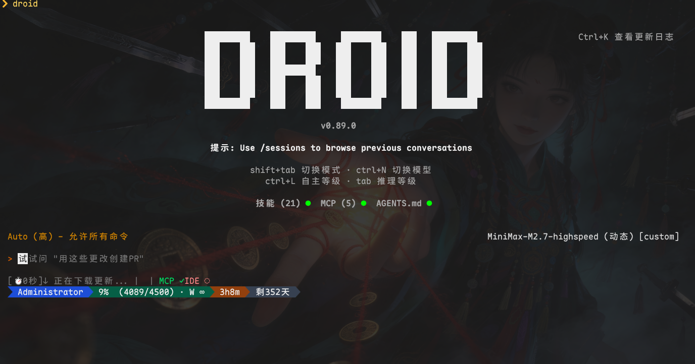

# MiniMax StatusBar

[](https://www.npmjs.com/package/minimax-status)
[](https://www.npmjs.com/package/minimax-status)
[](https://opensource.org/licenses/MIT)
[](https://marketplace.visualstudio.com/items?itemName=JochenYang.minimax-status-vscode)

MiniMax Token-Plan 使用状态监控工具，支持 CLI 命令和 Claude Code 状态栏集成。

## 版本

| 插件 | 版本 | 安装方式 |
|------|------|----------|
| **CLI** | 1.1.11 | `npm install -g minimax-status` |
| **VSCode** | 1.2.7 | [VSCode Marketplace](https://marketplace.visualstudio.com/items?itemName=JochenYang.minimax-status-vscode) 或 [下载 VSIX](https://github.com/JochenYang/minimax-status/releases) |
| **OpenClaw** | - | 参考 `openclaw/minimax-usage/` 目录 |

## 特性

- ✅ **实时状态监控**: 显示 MiniMax Token-Plan 使用额度、剩余次数、重置时间
- ✅ **上下文窗口跟踪**: 智能解析转录文件，准确显示当前会话的上下文使用量
- ✅ **多种显示模式**: 详细模式、紧凑模式、持续状态栏
- ✅ **Claude Code 集成**: 可在 Claude Code 底部状态栏显示
- ✅ **智能颜色编码**: 根据使用率自动切换颜色和图标
- ✅ **跨会话支持**: 自动从项目历史中查找上下文信息
- ✅ **简洁命令**: `minimax status` 查看状态
- ✅ **安全存储**: 凭据存储在独立的配置文件中

## 快速开始

### 1. 安装

```bash
npm install -g minimax-status
```

### 2. 更新(如果已经安装)

```bash
npm update -g minimax-status
```

### 3. 配置认证

```bash
minimax auth <token>
```

配置信息将保存在 `~/.minimax-config.json` 文件中。

获取令牌:

1. 访问 [MiniMax 开放平台](https://platform.minimaxi.com/user-center/payment/coding-plan)
2. 登录并进入控制台
3. Coding Plan 中创建或获取 API Key

### 4. 查看状态

```bash
# 详细模式
minimax status

# 紧凑模式
minimax status --compact

# 持续监控模式
minimax status --watch
```

## VSCode 扩展

提供 VSCode 扩展版本，支持在 VSCode 底部状态栏显示使用状态。

### 安装方式

**方式一：从 VSCode 市场安装（推荐）**

1. 在 VSCode 中搜索 "MiniMax Status"
2. 点击安装

**方式二：下载 VSIX 文件**

1. 访问 [GitHub Releases](https://github.com/JochenYang/minimax-status/releases)
2. 下载最新的 `.vsix` 文件
3. 在 VSCode 中按 `Ctrl+Shift+P`
4. 输入 "Extensions: Install from VSIX..."
5. 选择下载的 VSIX 文件

**方式二：从源码构建**

```bash
git clone https://github.com/JochenYang/minimax-status.git
cd minimax-status/vscode-extension
npm install
npm run package
# 在 VSCode 中安装生成的 .vsix 文件
```

### 配置步骤

1. 安装扩展后，点击状态栏的 "MiniMax 未配置" 按钮
2. 或使用命令 "MiniMax Status: 配置向导"
3. 输入您的 API Key
4. 配置完成后，状态栏将显示实时使用状态

## Claude Code 集成

将 MiniMax 使用状态显示在 Claude Code 底部状态栏。

### 配置步骤

1. **安装和配置工具**:

   ```bash
   npm install -g minimax-status
   minimax auth <token>
   ```

2. **配置 Claude Code**:

   编辑 `~/.claude/settings.json`:

   ```json
   {
     "statusLine": {
       "type": "command",
       "command": "minimax statusline"
     }
   }
   ```

3. **重启 Claude Code**

集成成功后，底部状态栏将显示:

```
my-app │ main * │ MiniMax-M2 │ 205K │ Usage ██████░░░░ 60% (2700/4500) │ ⏱ 1h20m │ 到期 5天
```

显示格式：`目录 │ 分支 │ 模型 │ 上下文 │ Usage 进度条 百分比(剩余/总数) │ ⏱ 倒计时 │ 到期 天数`

**颜色说明**:

- **上下文使用量**: ≥85%红色 | 60-85%黄色 | <60%绿色
- **到期时间**: ≤3天红色 | ≤7天黄色 | >7天绿色

### Git 分支显示说明

状态栏会显示当前 Git 分支信息：

```
my-app │ main * │ ...
```

**符号说明**:

| 符号 | 含义 |
|------|------|
| * | 有未提交的更改 |

**颜色规则**:

| 元素 | 颜色 | 说明 |
|------|------|------|
| 主分支 (main/master) | 绿色 | 默认/主分支 |
| 其他分支 | 白色 | 普通功能分支 |
| ⬆ 未推送 | 黄色 | 有待推送的 commit |
| ⬇ 未拉取 | 青色 | 有待拉取的 commit |
| • 未提交 | 红色 | 工作区有未提交的更改 |

### 上下文窗口显示说明

状态栏会智能显示当前会话的上下文窗口使用情况：

- **有转录数据时**: 显示 `⚡ 百分比·已用 tokens`
  - 例如: `⚡ 85%·150.0k tokens` 表示已使用 150K tokens，占容量的 85%

- **无转录数据时**: 仅显示上下文窗口总容量
  - 例如: `200K` 表示当前模型的上下文窗口大小

**智能特性**:

- ✅ 自动解析 Claude Code 转录文件（transcript）
- ✅ 支持 Anthropic 和 OpenAI 两种 token 格式
- ✅ 正确计算缓存 tokens（cache creation + cache read）
- ✅ 跨会话查找：当前会话无数据时，自动从项目历史中查找
- ✅ 处理 summary 类型条目和 leafUuid 引用

**注意**: MiniMax 的配置独立存储在 `~/.minimax-config.json`，与 Claude Code 的配置分离。

## Droid 集成

将 MiniMax 使用状态显示在 Droid 底部状态栏。

### 配置步骤

1. **安装和配置工具**:

   ```bash
   npm install -g minimax-status
   minimax auth <token>
   ```

2. **配置 Droid**:

   编辑 `~/.factory/settings.json`:

   ```json
   {
     "statusLine": {
       "type": "command",
       "command": "minimax droid-statusline"
     }
   }
   ```

3. **重启 Droid**

集成成功后，底部状态栏将显示:

```
minimax-status │ main * │ Usage █░░░░░░░░ 10% (4047/4500) │ ⏱ 12m │ 到期 21天
```

显示格式：`目录 │ 分支 │ Usage 进度条 百分比(剩余/总数) │ ⏱ 倒计时 │ 到期 天数`

### 进度条风格

使用 `█` 和 `░` 字符显示进度条：

- `█░░░░░░░░` - 10% 使用量
- `█████░░░░` - 50% 使用量
- `██████████` - 100% 使用量

**颜色说明**:

- **使用量**: ≥85%红色 | 60-85%黄色 | <60%绿色
- **到期时间**: ≤3天红色 | ≤7天黄色 | >7天绿色

## 显示示例

### 详细模式

```
┌─────────────────────────────────────────────────────────────┐
│ MiniMax Claude Code 使用状态                        │
│                                                             │
│ 当前模型: MiniMax-M2                          │
│ 时间窗口: 20:00-00:00(UTC+8)                          │
│ 剩余时间: 1 小时 42 分钟后重置                  │
│                                                             │
│ 已用额度: █████░░░░░░░░░░░░░░░░░░░░░░░ 6%  │
│      剩余: 4234/4500 次调用                   │
│      套餐到期: 02/26/2026（还剩 6 天）         │
│                                                             │
│ Token 消耗统计:                                       │
│      昨日消耗: 4996.4万                              │
│      近7天消耗: 2.8亿                              │
│      套餐总消耗: 14.7亿                             │
│                                                             │
│ 状态: ✓ 正常使用                                   │
└─────────────────────────────────────────────────────────────┘
```

### 紧凑模式

```
● MiniMax-M2 27% • 1 小时 26 分钟后重置 • ✓ 正常使用
```

### 持续状态栏模式

```
✓ MiniMax 状态栏已启动
按 Ctrl+C 退出

[● MiniMax-M2 27% • 3307/4500 • 1h26m ⚡
```

## 截图演示

### Claude Code 集成


### Droid 集成



## 命令说明

| 命令                    | 描述                                        | 示例                        |
| --------------------- | ------------------------------------------- | ----------------------------- |
| `minimax auth`        | 设置认证凭据                                 | `minimax auth <token>`         |
| `minimax status`      | 显示当前使用状态（支持 --compact、--watch） | `minimax status`                 |
| `minimax bar`         | 终端底部持续状态栏                          | `minimax bar`                    |
| `minimax statusline`  | Claude Code 状态栏集成                      | 用于 Claude Code 配置            |
| `minimax droid-statusline` | Droid 状态栏集成                      | 用于 Droid 配置            |

## 状态说明

### 显示元素

| 元素   | 说明                               |
| ------ | ---------------------------------- |
| 目录   | 当前工作目录                       |
| 分支   | Git 分支名称                       |
| 模型   | MiniMax 模型名称                   |
| 上下文 | 上下文窗口使用率                  |
| Usage  | 使用量进度条和百分比(剩余/总数)    |
| ⏱     | 额度重置倒计时                     |
| 到期   | 订阅到期时间（颜色动态变化）        |

### 进度条

使用 `█` 和 `░` 字符显示进度条：

- `█░░░░░░░░` - 10% 使用量
- `█████░░░░░` - 50% 使用量
- `██████████` - 100% 使用量

### 颜色规则

| 场景          | 颜色 | 说明     |
| ------------- | ---- | -------- |
| 上下文 ≥85%   | 红色 | 危险状态 |
| 上下文 60-85% | 黄色 | 注意使用 |
| 上下文 <60%   | 绿色 | 正常使用 |
| 到期 ≤ 3天    | 红色 | 即将到期 |
| 到期 ≤ 7天    | 黄色 | 即将到期 |
| 到期 > 7天    | 绿色 | 订阅正常 |

## 配置文件

### 默认位置

- 独立配置文件: `~/.minimax-config.json`

### 配置示例

```json
{
  "token": "your_access_token_here"
}
```

### Claude Code 配置

Claude Code 只需要配置状态栏命令：

```json
// ~/.claude/settings.json
{
  "statusLine": {
    "type": "command",
    "command": "minimax statusline"
  }
}
```

### 安全说明

凭据仅存储在本地，不会上传到任何服务器。

## 故障排除

### 命令未找到

```bash
# 确保已全局安装
npm install -g minimax-status

# 重新打开终端
```

### 认证失败

```bash
# 检查令牌
minimax status

# 重新设置认证
minimax auth <new_token>
```

### 状态栏不显示

1. 检查 Claude Code 配置
2. 重启 Claude Code
3. 手动测试: `minimax statusline`

## 开发

### 构建项目

```bash
git clone <repository>
cd minimax-status
npm install
```

### 测试

```bash
# 运行示例
node cli/example.js

# 测试 CLI 命令
node cli/index.js status
```

## 许可证

MIT License - 详见 [LICENSE](LICENSE) 文件

## 贡献

欢迎提交 Issue 和 Pull Request！

## 导航

| 客户端 | 路径 | 说明 |
|--------|------|------|
| **CLI** | [`cli/`](cli/) | 命令行工具，npm 全局包 |
| **VSCode** | [`vscode-extension/`](vscode-extension/) | VSCode 状态栏集成 |
| **OpenClaw** | [`openclaw/`](openclaw/) | OpenClaw 集成 |

---

## 相关链接

- [MiniMax 开放平台](https://platform.minimaxi.com/)

---

**注意**: 本工具仅用于监控 MiniMax Token-Plan 用量使用状态，不存储或传输任何用户数据。
